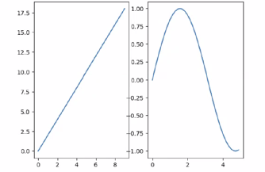
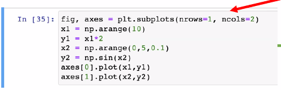
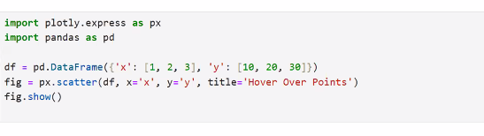

# dataScience-Matplotlib-Lec11-09-APR-25
Matplotlib - graphs
## presentation 23(page 11):
* Basic Plot Functions: 14-17 pages
* fig.add_axes([from_x,from_y,size_x,size_y])
* the zero starts at the button of the cell
## presentation 24 (pages 1-22)
* fig,axes=subplots(nrows=1,ncols=2):
  * to create system of graphs (like table) 1 rows will 2 columns, will split to 2 graphs
  * 
  * 
  * axes: the list of graphs created by subplots function
* fig=plt.figure(figsize=(7,2): to create the canvas, on it the graphs will be created
  * figsize=(width, height)- in inches, along the row.
  * on the canvas, you create the graphs with add_axes:
    * fig.add_axes
* lecture exersice in page 22
* extra: to do mouse hover and see the data(x,y) the library Matplotlib doesn't support.
  * there are other libraries that do,for example:
  